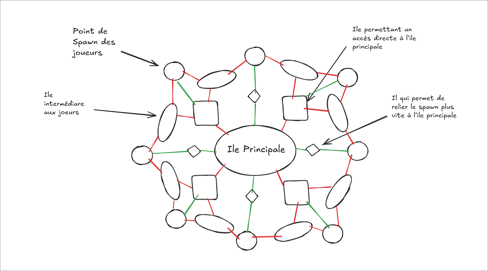
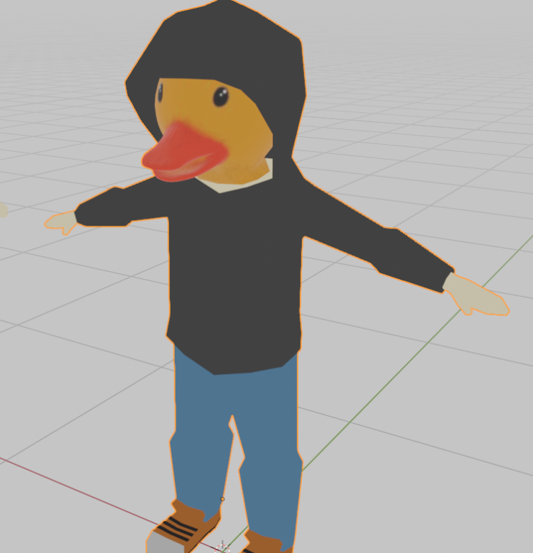

# 1. Concept du jeu

**Nom :** FEURnite

**Genre :** Battle Royale, Shooter en 3ème personne, Plateforme

**Plateformes :** PC

**Public cible :** Adolescents et adultes recherchant un gameplay fun et décalé avec des éléments de parodie.

**Pitch :** Dans FEURnite, tu incarnes un canard appelé "Koua", plongé dans une bataille royale où les îles volantes s'effondrent au fil du temps. Dans un mélange de plateforme et de shooter, les Kouas devront looter des armes et des items pour éliminer leurs adversaires et survivre à la chute des îles. Le dernier Koua en vie est couronné vainqueur.

# 2. Mécaniques de jeu

## 2.1. Système de Gameplay

**Objectif principal :** Survivre en étant le dernier **Koua** vivant.

**Caméra :** Vue à la 3ème personne pour accentuer la lisibilité des mouvements et des combats.

**Gameplay dynamique :** Le joueur saute de plateforme en plateforme, tire sur les autres joueurs et utilise son environnement à son avantage.

## 2.2. Spawn et Exploration

**Spawn :** Les joueurs apparaissent sur des îles périphériques. Sur ces îles, les joueurs trouveront chacun deux coffres qui leur sont destinés. Dans ces coffres, une arme et un ou deux objets leur seront donnés aléatoirement.

**Îles, Loot boxes et Loot :**
Les îles périphériques contiennent des armes et des équipements basiques. Ce butin est récupérable dans des loot boxes, qui se présentent sous la forme de petites boîtes carrées de différentes raretés. Plus les îles se rapprochent du centre de la carte, plus les loot boxes ont une chance d'être de haute rareté. Les raretés des loot boxes ont chacune leur couleur pour être différenciées, allant de bois, fer, or, à diamant. Plus la rareté est élevée, plus la loot box a de chances de donner du butin rare et puissant. Les loot boxes ont des points d'apparition prédéfinis et réapparaissent progressivement au fil du temps. Les armes ont elles aussi différents niveaux de rareté. Plus la rareté d'une arme est haute, plus les dégâts qu'elle inflige le seront. Les raretés sont les mêmes que pour les loot boxes. 

**Interconnexion des îles :** Des plateformes flottantes ou des ponts volants permettent de naviguer entre les îles.

## 2.3. Effondrement des îles

**Mécanique de chute des îles  :** Au fur et à mesure du temps, certaines îles s'effondrent de manière aléatoire ou progressive. Cela pousse les joueurs à se rapprocher du centre pour échapper à la chute et trouver du meilleur loot.

## 2.4. Combat

**Armes :** Armes à feu (fusils mitrailleur, fusils à pompes, bazookas, etc.), variété d'armes inspirées de parodies d'armes classiques, avec des effets humoristiques.

**Items spéciaux :** Plusieurs types de grenades (qui infligent des dégâts, qui repousse les joueurs, ...), potions à effet, objets qui permettent de revenir en arrière dans le temps, jetpack temporaire (permet de voler quelques secondes), ...

# 3. Carte du jeu

## 3.1. Design de la Carte

**Thème principal :** Un archipel d'îles flottantes dans le ciel, qui va de la plus petite à la plus grande, plus on se rapproche du centre.

**Dimensions :** Plusieurs îles de tailles différentes, reliées par des plateformes.
Le centre de la carte contient les îles avec le meilleur loot, mais également les plus dangereuses (combats plus fréquents).

## 3.2. Dynamique de la Carte

**Réduction progressive de la surface de jeu :** Les îles aux extrémités tombent à intervalle régulier, forçant les joueurs à se rapprocher du centre.

# 4. Personnages

## 4.1. Les Kouas

**Description :** Les joueurs incarnent des canards anthropomorphes, connus sous le nom de Koua. Les Kouas sont des canards avec un sweat à capuche. Leurs sweats changent de couleur en fonction de leurs équipes. (Possibilité de les personnaliser éventuellement, ex : changer de chapeau)

**Images :**

## 4.2. Compétences spéciales

**Dash rapide :** Les Kouas peuvent effectuer un "dash" pour esquiver ou traverser rapidement les plateformes.

**Saut double :** Capacité de réaliser un double saut pour échapper aux dangers ou atteindre des zones difficiles d'accès.

# 5. Interface et HUD

**Minicarte :** Affiche les îles encore intactes et les zones en train de s'effondrer.

**Inventaire rapide :** Barres d’accès rapide pour les armes et les items.

**Indicateurs de danger :** Alertes visuelles et auditives pour avertir de la chute imminente d’une île.

**Barre de vie :** Barre de vie en vert qui affiche la vie actuelle du koua qu'on contrôle.

**Barre de bouclier :** Barre de bouclier en bleu qui affiche le niveau de bouclier actuel du koua qu'on contrôle.

**Damage Popup :** Quand on infligera des dégâts à un Koua ennemi, le nombre de dégâts qu'on lui aura infligé sera affiché (pendant quelques instants) sur lui.

# 6. Mode Multijoueur

**Joueurs :** 8 à 10 joueurs par partie.

**Modes de jeu :**
- Solo : Chaque Koua pour soi.
- Duo : En équipes de deux pour des combats plus stratégiques.
- D'autres peut-être à venir ...

# 7. Esthétique et Son

**Style graphique :** Cartoonesque, coloré, et léger pour un ton humoristique.

**Animations :** Exagérées pour accentuer l’aspect comique (ex : un Koua qui tire avec un bazooka et se retrouve projeté en arrière).

**Sound Design :** Sons de canards (koua-koua), musiques épiques et humoristiques pour accompagner l'action.

Effets sonores amplifiés pour les armes, les chutes d’îles, ...

# 8. Inspirations et Références

**Fortnite :** Inspiration principale pour le concept de Battle Royale et le style humoristique.

**BABAP :** Pour le style visuel et l'aspect Battle Royale simplifié.

**Fall Guys :** Pour le mélange de plateforme et d’humour visuel.

# 9. Conclusion

FEURnite se veut un jeu Battle Royale parodique et fun, où l’action rapide et les situations comiques sont au cœur de l’expérience. Les mécaniques de plateformes et la chute des îles ajoutent une tension unique qui différencie le jeu des autres titres du genre.
