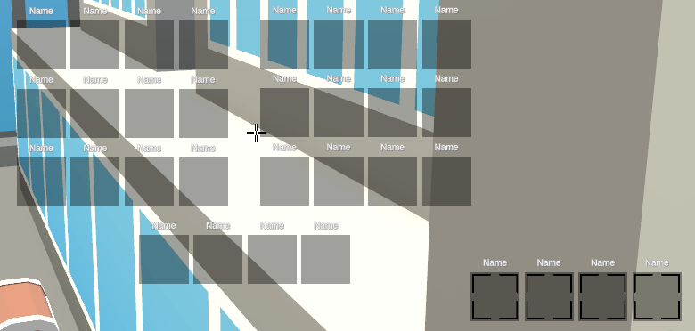

## **Guide Utilisateur**

### **1. Introduction**
- FEURnite est un battle royale où vous évoluez dans un univers avec plusieurs biômes qui contiennent plusieurs îles. Vous démarrez sur une île de spawn d'un des 4 biômes existant et votre objectif est de vous équipez du plus grand nombre d'armes possibles disponible dans des coffres, d'avancer vers l'île centrale, afin d'affronter les autres joueurs qui partagent le même objectif que vous, être le dernier survivant. Ne trainez pas car les îles peuvent tomber et disparaître à tout moment !

### **2. Prise en main**
#### Installation
- Téléchargement et installation via ...

#### Interface principale
- **Menu principal** : 

---

  
- **Nickname** : Votre pseudo   
- **Room Name** : Nom du serveur  
- **Start Game** : Lancement du jeu     
- **Back to Menu** : Revenir au menu principal      

---

- **Touches** : Changement des touches pour les mécaniques  
   

---

- **Son** : Changement du son général, effets sonores et musique  

---

- **Video** : Changement de la résolution   

---

- **Interface Utilisateur** :

---

- **Inventaire** : fonctionne en glisser/déposer  

---

- **Barre de vie/bouclier** : une fois la barre de vie vidée, vous avez perdu, de multiples potions sont disponibles afin de palier ce problème, faites bien attention !  

---

### **3. Gameplay**
#### Objectif principal
- Vous devez être le dernier survivant en éliminant les autres joueurs.

#### Mécaniques de base
- **Déplacement** : utilisez les touches ZQSD 
- **Sauter** : appuyez sur Espace 
- **Sprint** : maintenez Maj
- **Tirer** : bouton gauche de la souris 
- **Viser** : bouton droit de la souris 
- **Changer d’arme** : utilisez les touches numériques & é " ' (    
- **Gestion d’inventaire** : utilisez la touche E   
- **Emote** : utilisez la touche I  
- **Recharger** : utilisez la touche R  
- **Interagir** : utilisez la touche F
- **Lacher** : utilisez la touche G 

### **4. Astuces et conseils**
- **Guide pour les débutants** : les meilleures armes se trouvent sur les plus grandes îles et prenez votre temps sur les plateformes    
- **Stratégies avancées** : les parcours mènent souvent à un coffre rare, prenez rapidement la hauteur  

### **5. Paramètres et personnalisation**
- **Changement des paramètres en jeu** : appuyez sur Echap  
- **Personnalisation du personnage** : skins et emote disponibles

---
